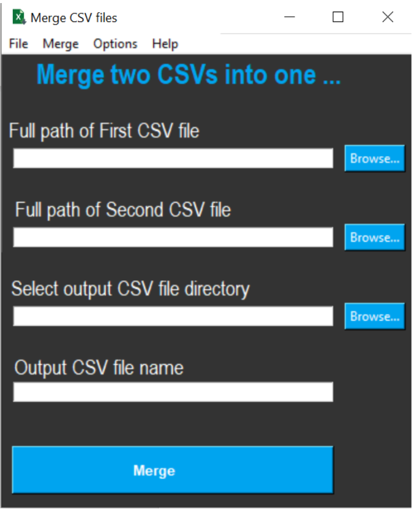

# CSV-files-merger
Desktop application which can merge two CSVs. It allows user to specify merge type options and common key column name while merging. This application has a beautifull GUI, libraries which I have used are Tkinter and Pandas. Pandas data frame I have used for this application in order to merge the CSV files. It can be deployed using cx_freeze library for windows environment as there is Setup.py file written for cx_freeze and this setup.py file can be find in this repository. This Setup.py file has been tested in Windows environment and deployed file is working perfectly.

## Programming languages and library
1. Python
2. TKinter library
3. Pandas library
